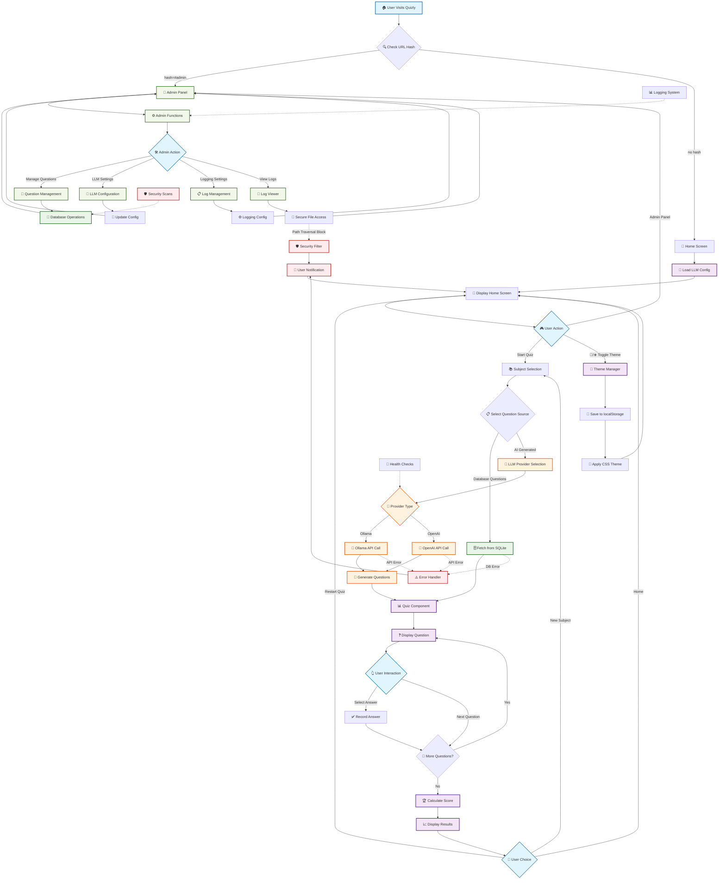

# 🧠 Quizly - Knowledge Testing Application

[](https://github.com/jmgress/Quizly-1/actions/workflows/ci.yml)

An interactive web-based quiz application that allows users to test their knowledge on various topics. Built with FastAPI backend and a responsive HTML/JavaScript frontend.

### Project Health
- ✅ **Backend**: FastAPI server with SQLite database
- ✅ **Frontend**: React-based user interface
- ✅ **Testing**: Comprehensive test suite (Backend: Python, Frontend: Jest)
- ✅ **CI/CD**: GitHub Actions workflow for automated testing
- ✅ **LLM Integration**: Multiple AI provider support (Ollama, OpenAI)
- ✅ **Documentation**: Complete API docs and setup guides
- ✅ **Security**: CWE-23 path traversal protection and comprehensive security testing
- ✅ **Logging**: Advanced logging system with configurable levels and log management

## Features

- 🎯 **Interactive Quiz Experience**: Multiple-choice questions with immediate feedback
- 📊 **Progress Tracking**: Visual progress bar and question counter
- 🏆 **Score Display**: Final score with percentage and performance message
- 📝 **Answer Review**: Detailed review of all answers after quiz completion
- 📱 **Responsive Design**: Works on desktop and mobile devices
- 🎨 **Modern UI**: Clean, gradient-based design with smooth animations
- 🔄 **Multiple Categories**: Questions across geography, science, math, and literature
- 🎯 **Subject Selection**: Choose your preferred quiz category before starting
- 🤖 **AI-Powered Questions**: Generate fresh questions using multiple LLM providers
- 📚 **Dual Question Sources**: Select between curated database questions or AI-generated content
- 🔌 **Provider-Based Architecture**: Easy switching between Ollama and OpenAI providers
- ⚙️ **Environment Configuration**: Configure providers via environment variables
- 🏥 **Health Checks**: Monitor LLM provider availability and status
- 🚀 **Fast API**: RESTful API with automatic documentation
- 🔒 **Security**: Path traversal protection and input validation
- 📊 **Logging**: Comprehensive logging with admin management interface

## Tech Stack

### Backend
- **FastAPI**: Modern, fast web framework for Python
- **SQLite**: Lightweight database for question storage
- **LLM Providers**: Configurable AI integration supporting Ollama and OpenAI
- **Pydantic**: Data validation and serialization
- **Uvicorn**: ASGI server for running FastAPI
- **Python-dotenv**: Environment variable management

### Frontend
- **React**: Modern JavaScript library for building user interfaces
- **React Hooks**: For state management and component lifecycle
- **Axios**: HTTP client for API communication
- **CSS3**: Modern styling with responsive design

## 🔄 Application Flow

The following diagram illustrates the complete user journey and system interactions in Quizly:



### Key Flow Components

1. **🏠 User Journey**: Home → Subject Selection → Quiz → Results
2. **🤖 LLM Integration**: Dynamic provider selection (Ollama/OpenAI) with health checks
3. **🔧 Admin Functions**: Question management, LLM configuration, logging oversight
4. **🛡️ Security Layer**: Path traversal protection, error handling, input validation
5. **🎨 Theme System**: Persistent user preferences with localStorage
6. **📊 Data Flow**: SQLite database ↔ FastAPI backend ↔ React frontend

## Quick Start

### Prerequisites
- Python 3.8+
- Node.js 14+
- npm (Node Package Manager)
- Modern web browser

### Backend Setup

1. **Navigate to the backend directory:**
   ```bash
   cd backend
   ```

2. **Install Python dependencies:**
   ```bash
   # Using requirements file (recommended)
   pip install -r requirements.txt
   
   # Or install minimal dependencies manually
   pip install fastapi uvicorn python-dotenv
   ```

3. **Run the backend server:**
   ```bash
   python main.py
   ```
   
   The API will be available at `http://localhost:8000`
   
   **API Documentation:** Visit `http://localhost:8000/docs` for interactive API documentation

### Frontend Setup

1. **Navigate to the frontend directory:**
   ```bash
   cd frontend
   ```

2. **Install dependencies:**
   ```bash
   npm install
   ```

3. **Start the React development server:**
   ```bash
   npm start
   ```

4. **Open in browser:**
   Visit `http://localhost:3000`

The React dev server will automatically reload when you make changes to the code.

### Automated Setup (Recommended)

For the easiest setup, use the provided startup script that handles both backend and frontend:

```bash
./start.sh
```

This script will:
- Check for required dependencies (Python 3.8+, Node.js, npm)
- Install npm packages if needed
- Start both backend and frontend servers

### LLM Provider Configuration

Quizly supports multiple LLM providers for AI question generation. You can easily switch between providers using environment variables.

#### 1. Environment Setup

Create a `.env` file in the project root directory (copy from `.env.example`):

```bash
cp .env.example .env
```

#### 2. Configure Your Preferred Provider

Edit the `.env` file to configure your preferred LLM provider:

**For Ollama (Default):**
```env
LLM_PROVIDER=ollama
OLLAMA_MODEL=llama3.2
OLLAMA_HOST=http://localhost:11434
```

**For OpenAI:**
```env
LLM_PROVIDER=openai
OPENAI_API_KEY=your-openai-api-key-here
OPENAI_MODEL=gpt-4o-mini
```

#### 3. Provider-Specific Setup

**Ollama Setup:**
1. Install Ollama from [ollama.ai](https://ollama.ai)
2. Pull the required model:
   ```bash
   ollama pull llama3.2
   ```
3. Start Ollama service:
   ```bash
   ollama serve
   ```

**OpenAI Setup:**
1. Get your API key from [OpenAI](https://platform.openai.com/api-keys)
2. Set the `OPENAI_API_KEY` environment variable
3. Choose your preferred model (default: gpt-3.5-turbo)

#### 4. Health Check

You can check the health of your configured LLM provider:

```bash
curl http://localhost:8000/api/llm/health
```

This will return:
```json
{
  "provider": "ollama",
  "healthy": true,
  "available_providers": ["ollama"]
}
```

#### 5. Supported Configuration Options

| Environment Variable | Description | Default |
|---------------------|-------------|---------|
| `LLM_PROVIDER` | Provider type: "ollama" or "openai" | ollama |
| `OLLAMA_MODEL` | Ollama model name | llama3.2 |
| `OLLAMA_HOST` | Ollama server URL | http://localhost:11434 |
| `OPENAI_API_KEY` | OpenAI API key | - |
| `OPENAI_MODEL` | OpenAI model name | gpt-4o-mini |
| `DEFAULT_QUESTION_LIMIT` | Default number of questions | 5 |
| `LOG_LEVEL` | Logging level | INFO |

### AI Question Generation Setup (Optional)

To enable AI-powered question generation, you need to set up at least one LLM provider:

#### Option A: Ollama (Local/Free)

1. **Install Ollama:**
   - Visit [ollama.ai](https://ollama.ai) and follow the installation instructions for your platform
   - Or use the command line:
     ```bash
     curl -fsSL https://ollama.ai/install.sh | sh
     ```

2. **Pull the required model:**
   ```bash
   ollama pull llama3.2
   ```

3. **Start Ollama service:**
   ```bash
   ollama serve
   ```

#### Option B: OpenAI (Cloud/Paid)

1. **Get an OpenAI API key:**
   - Visit [OpenAI Platform](https://platform.openai.com/api-keys)
   - Create a new API key

2. **Configure the environment:**
   ```bash
   echo "LLM_PROVIDER=openai" >> .env
   echo "OPENAI_API_KEY=your-actual-api-key" >> .env
   ```

Once configured, the AI question generation feature will work automatically. If no provider is available, users can still use curated database questions.

The startup script will also display the URLs where the application is running.

Press `Ctrl+C` to stop both servers when done.

## How to Use

1. **Start Quiz**: Click "Start Quiz" on the home screen
2. **Select Subject**: Choose your preferred quiz category (Geography, Science, Math, Literature)
3. **Choose Question Source**:
   - **📚 Curated Questions**: High-quality pre-written questions from the database
   - **🤖 AI-Generated Questions**: Fresh questions powered by your configured LLM provider (Ollama or OpenAI)
4. **Take Quiz**: Answer questions and see immediate feedback
5. **View Results**: Review your score and answer details at the end

### AI Question Generation

The AI question generation feature uses your configured LLM provider to create fresh, unique questions on any topic. The system will:

- Generate questions based on the selected subject
- Format them consistently with the existing question structure
- Provide appropriate difficulty levels
- Include proper multiple-choice options with correct answers

If AI generation fails (provider offline, API quota exceeded, etc.), the system will gracefully fall back to curated database questions.

### Admin Interface

The admin interface allows you to view and edit all quiz questions stored in the database.

**Access the Admin Panel:**
1. Navigate to the Quizly homepage
2. Click the "Admin Panel" button, or
3. Go directly to `http://localhost:3000/#admin`

**Admin Features:**
- **View All Questions**: See all questions with their options, correct answers, and categories
- **Edit Questions**: Click "Edit" on any question to modify:
  - Question text
  - Answer options (A, B, C, D)
  - Correct answer selection
  - Category assignment
- **Save Changes**: Click "Save" to update questions or "Cancel" to discard changes
- **Error Handling**: Validation ensures all required fields are filled and correct answers are valid

**Admin Interface Usage:**
- No authentication required (access via direct URL)
- Real-time feedback on save operations
- Mobile-responsive design for editing on any device
- Automatic validation of question format and correct answers

**LLM Settings Management:**
- Configure AI providers (Ollama, OpenAI) through the web interface
- Test provider connectivity and model availability
- Switch between providers without restarting the application
- View real-time provider health status

**Logging Management:**
- View and download application logs through the admin interface
- Configure log levels (DEBUG, INFO, WARNING, ERROR)
- Clear and rotate log files
- Secure file access with path traversal protection (CWE-23 compliance)

## API Endpoints

### Questions
- **GET** `/api/questions` - Get quiz questions (supports `?category=<category>&limit=<limit>`)
- **PUT** `/api/questions/{id}` - Update a question's content (admin endpoint)
- **GET** `/api/questions/ai` - Generate AI-powered questions (supports `?subject=<subject>&limit=<limit>&model=<model>`)
- **GET** `/api/categories` - Get available question categories

### LLM Provider Management
- **GET** `/api/llm/health` - Check LLM provider health and availability
- **GET** `/api/models` - List available models for the current provider

### Configuration Management
- **GET** `/api/config` - Get current configuration settings
- **PUT** `/api/config` - Update configuration settings

### Logging Management
- **GET** `/api/logging/files` - List available log files
- **GET** `/api/logging/files/{filename}/download` - Download log file (secure)
- **POST** `/api/logging/files/{filename}/clear` - Clear log file contents
- **POST** `/api/logging/files/{filename}/rotate` - Rotate log file
- **GET** `/api/logging/config` - Get logging configuration
- **PUT** `/api/logging/config` - Update logging configuration

### Quiz Management
- **POST** `/api/quiz/submit` - Submit quiz answers and get results
- **GET** `/api/quiz/{quiz_id}` - Get quiz results by ID

### Example API Usage

**Get Questions:**
```bash
curl http://localhost:8000/api/questions
```

**Get Questions by Category:**
```bash
curl "http://localhost:8000/api/questions?category=geography&limit=5"
```

**Check LLM Provider Health:**
```bash
curl http://localhost:8000/api/llm/health
```

**Generate AI Questions:**
```bash
curl "http://localhost:8000/api/questions/ai?subject=history&limit=3&model=gpt-4"
```

**Submit Quiz:**
```bash
curl -X POST http://localhost:8000/api/quiz/submit \
  -H "Content-Type: application/json" \
  -d '{"answers": [{"question_id": 1, "selected_answer": "c"}]}'
```

**Update Question (Admin):**
```bash
curl -X PUT http://localhost:8000/api/questions/1 \
  -H "Content-Type: application/json" \
  -d '{"text": "Updated question text?", "category": "updated_category"}'
```

## Database Schema

The application uses SQLite with the following tables:

**Questions Table:**
- `id` (INTEGER PRIMARY KEY)
- `text` (TEXT) - Question text
- `options` (TEXT) - JSON array of answer options
- `correct_answer` (TEXT) - ID of correct option
- `category` (TEXT) - Question category

**Quiz Sessions Table:**
- `id` (TEXT PRIMARY KEY) - Unique quiz session ID
- `total_questions` (INTEGER)
- `correct_answers` (INTEGER)
- `score_percentage` (REAL)
- `created_at` (TEXT) - ISO timestamp
- `answers` (TEXT) - JSON array of answer details

## Sample Questions

The application comes with 5 sample questions covering:
- 🌍 **Geography**: Capitals and geography facts
- 🔬 **Science**: Planets and scientific knowledge
- 🔢 **Math**: Basic arithmetic
- 📚 **Literature**: Classic authors and works

## Development

### Adding New Questions

You can add questions directly to the database or extend the initialization code in `backend/main.py`:

```python
sample_questions = [
    {
        "text": "Your question here?",
        "options": [
            {"id": "a", "text": "Option A"},
            {"id": "b", "text": "Option B"},
            {"id": "c", "text": "Option C"},
            {"id": "d", "text": "Option D"}
        ],
        "correct_answer": "a",  # ID of correct option
        "category": "your_category"
    }
]
```

### Testing the Backend

Run the test script to verify backend functionality:
```bash
# Run individual backend tests
cd tests/backend/unit
python test_database.py

# Run all backend tests
cd tests/backend
python -m pytest
```

### Testing the Frontend

The frontend is configured with Jest and React Testing Library for unit testing. Tests are available for the core components.

**Running Tests:**
```bash
cd frontend
npm test
```

**Running Tests with Coverage:**
```bash
cd frontend
npm test -- --coverage --collectCoverageFrom="src/components/**/*.{js,jsx}"
```

**Running Tests in CI Mode (no watch):**
```bash
cd frontend
npm test -- --watchAll=false
```

**Test Files:**
- `tests/frontend/unit/components/Question.test.js` - Tests for Question component
- `tests/frontend/unit/components/ScoreDisplay.test.js` - Tests for ScoreDisplay component
- `tests/frontend/unit/components/Quiz.test.js` - Tests for Quiz component
- `tests/frontend/unit/components/SubjectSelection.test.js` - Tests for SubjectSelection component  
- `tests/frontend/unit/components/AdminQuestions.test.js` - Tests for AdminQuestions component
- `tests/frontend/unit/components/LoggingSettings.test.js` - Tests for LoggingSettings component

**Note:** Frontend tests have been moved to a centralized structure in `/tests/frontend/`. The Jest configuration may need updating to run tests from the new location.

**What's Tested:**
- Question component rendering and user interactions
- ScoreDisplay component score display and answer review functionality
- Component snapshots for visual regression testing
- Coverage targets: ≥80% for tested components

### CORS Configuration

The backend is configured to accept requests from `http://localhost:3000`. To change this, modify the CORS settings in `backend/main.py`:

```python
app.add_middleware(
    CORSMiddleware,
    allow_origins=["http://localhost:3000", "your-domain.com"],
    allow_credentials=True,
    allow_methods=["*"],
    allow_headers=["*"],
)
```

## Project Structure

```
Quizly-1/
├── backend/
│   ├── main.py              # FastAPI application
│   ├── requirements.txt     # Python dependencies
│   ├── requirements-dev.txt # Development dependencies
│   ├── database.py          # Database operations
│   ├── config_manager.py    # Configuration management
│   ├── logging_config.py    # Logging configuration
│   ├── llm_providers/       # LLM provider implementations
│   │   ├── base.py          # Base provider interface
│   │   ├── ollama_provider.py
│   │   └── openai_provider.py
│   └── quiz.db             # SQLite database (auto-generated)
├── frontend/
│   ├── package.json        # React dependencies
│   ├── public/             # Public assets
│   │   └── index.html      # HTML template for React
│   └── src/                # React components
│       ├── App.js          # Main App component
│       ├── index.js        # React entry point
│       ├── index.css       # Global styles
│       └── components/
│           ├── Quiz.js           # Quiz logic component
│           ├── Question.js       # Question display component
│           ├── ScoreDisplay.js   # Score display component
│           ├── SubjectSelection.js # Subject selection
│           ├── AdminPanel.js     # Admin interface
│           ├── AdminQuestions.js # Question management
│           ├── LLMSettings.js    # LLM configuration
│           └── LoggingSettings.js # Logging management
├── tests/                  # Centralized test organization
│   ├── backend/           # Backend tests
│   │   ├── unit/          # Unit tests (including security tests)
│   │   ├── integration/   # Integration tests
│   │   └── fixtures/      # Test fixtures
│   ├── frontend/          # Frontend tests
│   │   ├── unit/          # Component unit tests
│   │   └── integration/   # Integration tests
│   ├── e2e/              # End-to-end tests
│   └── shared/           # Shared test utilities
├── docs/                  # Documentation
├── scripts/               # Utility scripts
├── logs/                  # Application logs
├── .github/workflows/     # GitHub Actions CI/CD
├── start.sh               # Application launcher
├── run_tests.sh          # Test runner script
├── .env.example          # Environment variables template
├── README.md
├── TESTING_GUIDE.md      # Comprehensive testing guide
└── LICENSE
```

## Contributing

1. Fork the repository
2. Create a feature branch
3. Make your changes
4. Add tests if applicable
5. Submit a pull request

## License

This project is licensed under the MIT License - see the [LICENSE](LICENSE) file for details.

## Future Enhancements

- 👤 User authentication and profiles
- 📈 Quiz history and statistics
- 🏷️ Custom quiz categories
- ⏱️ Timed quizzes
- 🎮 Multiplayer quiz mode
- 📱 Progressive Web App (PWA) support
- 🌐 Internationalization
- 📊 Admin dashboard for question management

## 📱 Application Screenshots & Features

### Main Interface
- **Subject Selection Screen**: Clean, intuitive interface for choosing quiz categories
- **Question Display**: Modern card-based design with multiple-choice options
- **Progress Tracking**: Visual progress bar showing completion status
- **Score Summary**: Detailed results with performance feedback and answer review

### Key User Interface Elements
- **Responsive Design**: Optimized for both desktop and mobile devices
- **Modern Gradient Theme**: Professional blue-to-purple gradient styling
- **Interactive Buttons**: Smooth hover effects and animations
- **Real-time Feedback**: Immediate visual feedback for correct/incorrect answers

### Admin Panel Features
- **Question Management**: Browse, edit, and manage quiz questions
- **LLM Configuration**: Configure AI providers (Ollama, OpenAI) for question generation
- **Logging Settings**: Monitor application logs and configure log levels
- **Provider Health Monitoring**: Real-time status of connected LLM services

### API Features
- **Interactive Documentation**: Auto-generated API docs at `/docs`
- **RESTful Endpoints**: Clean, well-documented API structure
- **Health Checks**: Monitor backend and LLM provider status
- **Error Handling**: Comprehensive error responses with helpful messages

## 🧪 Testing

The application includes a comprehensive test suite covering both backend and frontend components.

### Run All Tests
```bash
./run_tests.sh
```

### Run Individual Test Suites
```bash
# Backend tests only
cd backend && python -m pytest tests/ -v

# Frontend tests only 
cd frontend && npm test

# Integration tests
cd tests && python -m pytest integration/ -v
```

### Test Coverage
- **Backend**: Unit tests, integration tests, LLM provider tests
- **Frontend**: Component tests, user flow tests, API integration tests
- **E2E**: End-to-end testing with real user scenarios

## 🚀 Quick Demo

1. **Start the application**: `./start.sh`
2. **Open browser**: Visit `http://localhost:3000`
3. **Select a subject**: Choose from Geography, Science, Math, or Literature
4. **Choose question source**: Database questions or AI-generated content
5. **Take the quiz**: Answer multiple-choice questions with immediate feedback
6. **View results**: See your score and review correct answers

### Admin Features Demo
- **Visit**: `http://localhost:3000` and access the admin panel
- **Manage Questions**: View and edit the question database
- **Configure LLM**: Set up AI providers for question generation
- **Monitor Logs**: View application logs and adjust logging levels