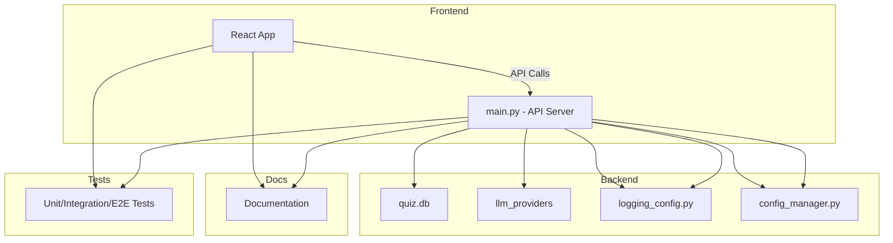

# Quizly Documentation

Welcome to the Quizly project documentation. This folder contains comprehensive guides and documentation for the Quizly quiz application.

## 📋 Table of Contents

### Development & Testing
- [**TESTING_GUIDE.md**](./TESTING_GUIDE.md) - Comprehensive testing guide for backend and frontend
- [**AI_TEST_FIX.md**](./AI_TEST_FIX.md) - AI integration testing fixes and improvements

### DevOps & CI/CD
- [**GITHUB_ACTIONS_SETUP.md**](./GITHUB_ACTIONS_SETUP.md) - GitHub Actions CI/CD pipeline setup and configuration
- [**GITLEAKS_INTEGRATION_SUMMARY.md**](./GITLEAKS_INTEGRATION_SUMMARY.md) - GitLeaks security scanning integration guide

### Bug Fixes & Improvements
- [**LOGGING_FIXES.md**](./LOGGING_FIXES.md) - Logging system fixes and improvements

## 🎯 Quick Navigation

### For Developers
- Start with [TESTING_GUIDE.md](./TESTING_GUIDE.md) to understand the testing framework
- Review [AI_TEST_FIX.md](./AI_TEST_FIX.md) for AI integration details

### For DevOps
- Setup CI/CD with [GITHUB_ACTIONS_SETUP.md](./GITHUB_ACTIONS_SETUP.md)
- Implement security scanning with [GITLEAKS_INTEGRATION_SUMMARY.md](./GITLEAKS_INTEGRATION_SUMMARY.md)

### For Troubleshooting
- Check [LOGGING_FIXES.md](./LOGGING_FIXES.md) for logging-related issues

## 📁 Project Structure

```
docs/
├── README.md                           # This file
├── TESTING_GUIDE.md                   # Testing documentation
├── AI_TEST_FIX.md                     # AI testing fixes
├── GITHUB_ACTIONS_SETUP.md           # CI/CD setup guide
├── GITLEAKS_INTEGRATION_SUMMARY.md   # Security scanning setup
└── LOGGING_FIXES.md                  # Logging improvements
```

## 🔧 Contributing

When adding new documentation:
## Architecture Diagram



1. **Follow clean code principles** - Use clear, descriptive filenames
2. **Maintain consistent formatting** - Follow the existing markdown style
3. **Update this index** - Add new documents to the table of contents
4. **Use meaningful sections** - Break content into logical, easy-to-navigate sections

## 📖 Documentation Standards

All documentation in this folder follows these standards:

- **Clear headings** with emoji indicators for easy scanning
- **Code examples** with proper syntax highlighting
- **Step-by-step instructions** for complex procedures
- **Cross-references** between related documents
- **Version information** and last updated dates where relevant

---

For the main project information, see the [root README.md](../README.md).
